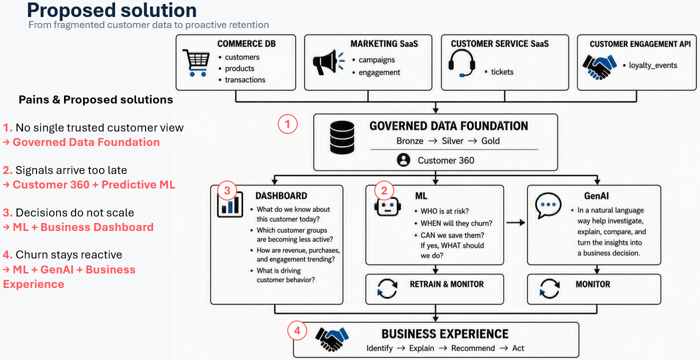

# Retail Customer Intelligence Lakehouse on Databricks

## Overview

This project demonstrates how a modern retail organization can use the **Databricks Lakehouse Platform** to solve common customer data and analytics challenges. The solution is built around a fictional retail organization facing the following challenges:
- Customer data stored across isolated systems
- No single, trusted customer view
- Customer signals arriving too late to drive action
- Manual decision-making processes that do not scale
- Reactive rather than proactive churn management

The objective is to build an **end-to-end Lakehouse architecture** capable of ingesting, processing, governing, analyzing, and operationalizing customer data at scale.

The solution follows the **Databricks Medallion Architecture** and demonstrates how a unified data platform can support:

- Business intelligence and executive dashboards
- Predictive machine learning
- Generative AI applications
- Scalable customer analytics
- Operational customer intelligence

---

## Business Challenge

Retail organizations generate large volumes of customer data across multiple channels, including:

- E-commerce transactions
- Loyalty programs
- CRM systems
- Marketing platforms
- Customer service interactions
- Mobile applications

When this data is fragmented across systems, organizations commonly experience several problems such as:
- **Data Silos:** Customer information is distributed across disconnected systems, making it difficult to build a complete picture of customer behavior.
- **No Single Customer View:** Different teams may work with inconsistent customer records, making it difficult to establish a trusted source of truth.
- **Delayed Customer Signals:** By the time changes in customer behavior are identified, opportunities for engagement or intervention may already have been missed.
- Business teams spend significant time performing manual analysis instead of leveraging automated, data-driven processes.
- Customers are often targeted only after they have already disengaged, limiting the effectiveness of retention strategies.

---

## Distributed Processing with PySpark
A key objective of the project is demonstrating scalable distributed data processing using PySpark on Databricks.

The pipeline follows distributed-processing best practices and avoids common Spark anti-patterns.

Key Principles:
- Distributed DataFrame transformations
- Minimized data movement
- Efficient aggregations and joins
- Scalable processing of large datasets
- Lakehouse-native processing patterns
- Avoidance of unnecessary driver-side computation
- Avoid Spark Anti-Patterns for distributed computing

## Solution Architecture

